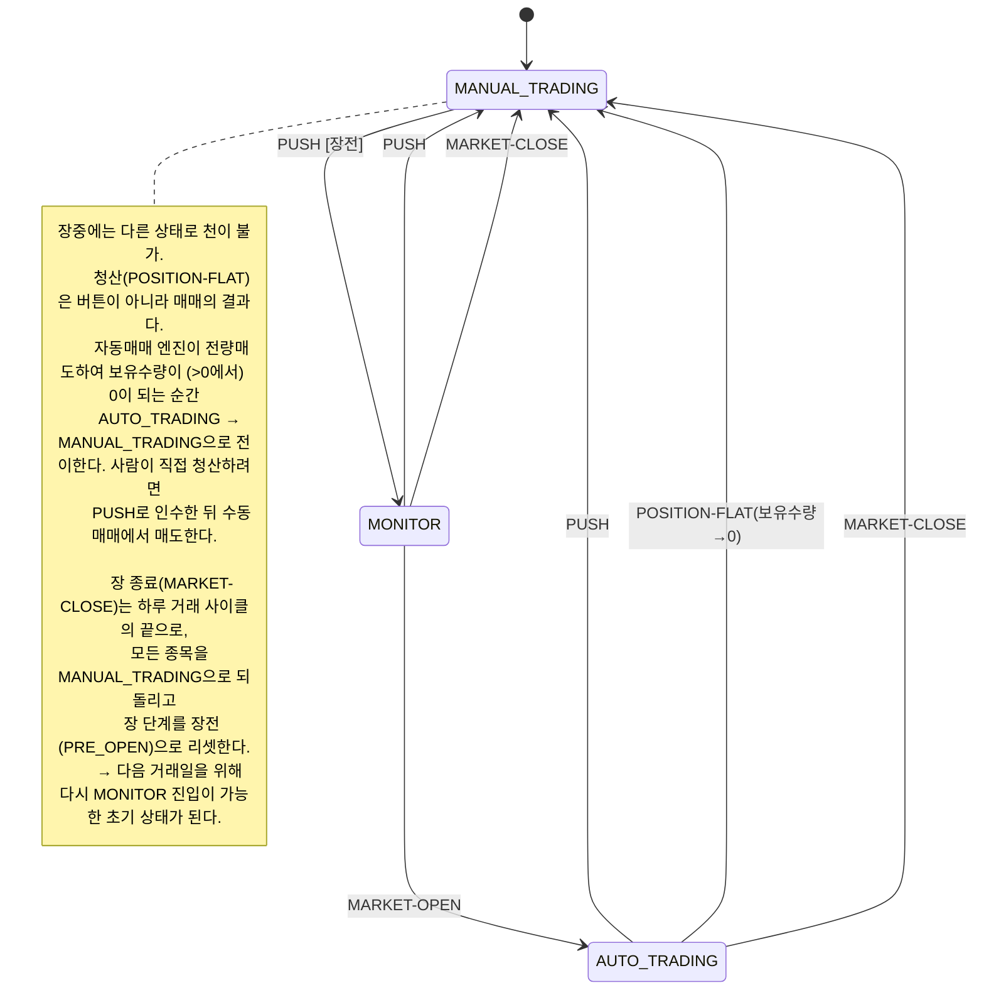

# 주식 거래 앱

`/home/rblue/work/kiwoom` 을 참고하여 주식 거래 앱을 만들고자 한다.

거래하고자 하는 주식 종목 코드 입력 인터페이스가 필요하다.
이곳을 통해 거래하고자하는 하나 이상의 종목 코드를 입력할 수 있다.

**AUTO-TRADING**
어떤 종목의 AUTO-TRADING을 위한 설정의 입력 수단이 필요해.
이 입력 변수들에 어떤 것이 있는지는 `/home/rblue/work/kiwoom/doc/상한가 전략.md`과 `/home/rblue/work/kiwoom/trading_config.yaml`를 참고하면 되는데, `/home/rblue/work/kiwoom/doc/상한가 전략 시각화.md`에 요약해 두었어.

**MANUAL-TRADING**
이 상태에서는 사용자가 직접적으로 매수 매도 버튼을 눌려 매도할거야.
얼마를 매수할지, 몇주를 매도할지를 지정할 수 있어.
일단 장중 AUTO-TRADING 중 MANUAL-TRADING 으로 천이하면 AUTO-TRADING으로 돌아가지 않아.

**State Transition**
각 차트는 state를 갖으며 state는 버튼과 연동되어 있는데 그것의 변화는 다음과 같고
button의 누르는 동작 (push event)과 장시작 event, 장종료 event에 따라
state의 천이가 발생해. 현재의 state는 버튼에 표시되.
state 천이는 다음의 다이어그램에 따른다:

**Chart**
* 각 종목 별로 chart를 보여주는데 3분봉, 5분봉, 10분봉, 30분봉, 60분봉 중 하나를 선택할 수 있다. (기본 3분봉)

* 봉의 색깔
    * 상승 (해당 봉의 시가 대비): 적색
    * 하락 (해당 봉의 시가 대비): 청색
    * 봉의 내부는 투명하며 테두리만 그린다

* 봉의 단순이평 (5,10, 20, 60봉)을 겹쳐 그린다.
    * 이평선의 색깔
        * 5-이평선의 색깔: 파랑
        * 10-이평선의 색깔: 분홍
        * 20-이평선의 색깔: 주황
        * 60-이평선의 색깔: 초록
    * 이평선을 그리기 위해서는 해당일 이전의 과거 60개의 봉이 추가로 필요할 것이다. 그래야 당일 첫봉에 해당하는 이평선의 값을 계산할 수 있으니까.
        * 예: 30분봉 차트상의 60-이평선을 그리려면 해당일이전의 과거 60개의 30분봉 필요

* Chart는 Javascript로 구현하거나 좋은 오픈소스 라이브러리나 무료 라이선스 라이브러리가 있다면 그것을 사용해.

* Chart 옆에는 장중 고가 저가 현재가가 실시간으로 표시되어야 하고
* 커서를 Chart 위에 가져다 대면 커서 끝이 가리키는 가격에 대응하는 수평선이 표시되고 가격이 표시되어야 해. 손절라인을 가늠하는데 도움을 주기 위해서야.

**기타**
- Web page의 분위기로서 Light theme을 적용한다.
- React javascript 라이브러리를 사용해
- 편리하고 직관적이고 과학적인 인터페이스를 생각해내.
